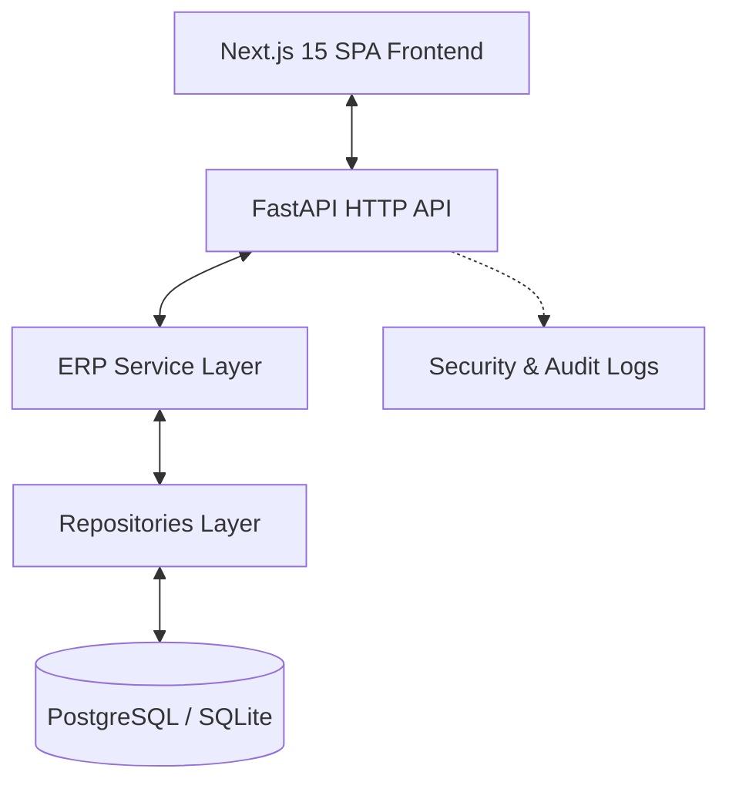

# Sandeep Traders Business Suite (Enterprise Edition)

A modern, high-performance Enterprise Resource Planning (ERP) suite tailored for Sandeep Traders. Built on a modernized, secure, and decoupled architecture with a FastAPI backend and a Next.js 15 frontend.

---

## 🏗️ Architecture Design



- **Frontend**: Next.js 15 (App Router), TypeScript, Tailwind CSS v4, Zustand, and TanStack React Query.
- **Backend**: FastAPI (Python 3.10+), SQLAlchemy (Async Session), Pydantic v2.
- **Database**: SQLite (local dev memory/file) / PostgreSQL (production).
- **Security**: Argon2id password hashing, JWT HttpOnly security tokens, and strict Role-Based Access Control (RBAC).

---

## 🔐 Role-Based Access Control (RBAC)

The system enforces permissions on both the frontend UI and backend endpoints:

| Feature / Action | Admin | Owner | Manager | Staff |
| :--- | :---: | :---: | :---: | :---: |
| **System Settings** | ✅ | ✅ | ✅ | ❌ |
| **Delete Operations** | ✅ | ✅ | ✅ | ❌ |
| **Invoice / Return Create & View** | ✅ | ✅ | ✅ | ✅ |
| **Ledger Postings & Views** | ✅ | ✅ | ✅ | ✅ |
| **User & Audit Trail Management** | ✅ | ❌ | ❌ | ❌ |
| **Sensitive Reports** | ✅ | ✅ | ✅ | ❌ |

---

## 🚀 How to Run Locally

### 1. Prerequisites
- **Python**: version 3.10 or higher
- **Node.js**: version 18.0 or higher
- **Package Managers**: `pip` (Python), `npm` (Node)

---

### 2. Running the FastAPI Backend

1. **Navigate to the backend directory**:
   ```bash
   cd backend
   ```

2. **Create and activate a virtual environment**:
   ```bash
   # On Windows (PowerShell/CMD):
   python -m venv venv
   .\venv\Scripts\Activate

   # On macOS/Linux:
   python3 -m venv venv
   source venv/bin/activate
   ```

3. **Install python dependencies**:
   ```bash
   pip install -r requirements.txt
   ```

4. **Set Up environment variables**:
   Create a `.env` file in the root of the `backend/` directory:
   ```env
   ENVIRONMENT=development
   DATABASE_URL=sqlite+aiosqlite:///./sandeep_traders.db
   SECRET_KEY=dev-secret-key-12345
   ACCESS_TOKEN_EXPIRE_MINUTES=15
   ```

5. **Start the development server**:
   FastAPI automatically seeds default users and catalog products on first run.

   **Option A: Run from project root (Recommended)**
   ```bash
   uvicorn backend.app.main:app --reload --port 8000
   ```

   **Option B: Run from `backend` directory**
   If you prefer running inside the `backend` directory, set the Python Path:
   ```bash
   # On Windows (PowerShell):
   $env:PYTHONPATH=".."
   uvicorn app.main:app --reload --port 8000

   # On macOS/Linux/Git Bash:
   PYTHONPATH=.. uvicorn app.main:app --reload --port 8000
   ```
   - API Docs will be available at: http://127.0.0.1:8000/docs
   - Default development user accounts are automatically seeded on first application startup ONLY for local development:
     - **Admin**: `admin` (Admin Role)
     - **Staff**: `mandeep` (Staff Role)
     - **Owner**: `sandeep` (Owner Role)
     *(Passwords are configured securely via the local development seed database settings and stored using Argon2id.)*

---

### 3. Running the Next.js Frontend

1. **Navigate to the frontend directory**:
   ```bash
   cd frontend
   ```

2. **Install Node dependencies**:
   ```bash
   npm install
   ```

3. **Set Up environment variables**:
   Create a `.env.local` file in the `frontend/` directory:
   ```env
   NEXT_PUBLIC_API_URL=http://localhost:8000
   ```

4. **Start the development server**:
   ```bash
   npm run dev
   ```
   Open http://localhost:3000 in your browser to view the application.

---

## 🧪 Running the Backend Tests

We have a comprehensive end-to-end integration and regression suite.
To execute tests:
```bash
cd backend
python -m pytest tests/test_backend.py -v
```

---

## 📦 Deployment to Render.com

This app is pre-configured for simple deployment:
1. **Database**: Spin up a "Render PostgreSQL" service.
2. **Backend (FastAPI)**: Deploy as a "Render Web Service", setting build command: `pip install -r requirements.txt` and start command: `uvicorn backend.app.main:app --host 0.0.0.0 --port $PORT`. Configure environment variables (`DATABASE_URL`, `SECRET_KEY`).
3. **Frontend (Next.js)**: Deploy as a "Render Static Site", pointing build command to `npm run build` and output directory to `.next` (or build static export). Set `NEXT_PUBLIC_API_URL` to point to the backend web service URL.
